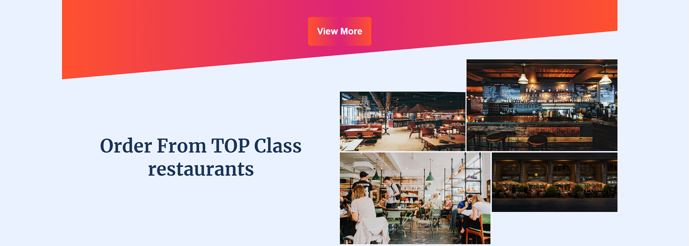

<b>Zomato Frontend Page</b>

Welcome to the Zomato Frontend Page! This repository contains the frontend code for the Zomato web application,
which is a popular online platform for discovering and ordering food from local restaurants.

<b>Technologies Used:</b>

The Zomato Frontend Page utilizes the following technologies:

<b>HTML</b>: Markup language for structuring the web pages.

<b>CSS</b>: Styling language for visually enhancing the UI.

Webpage looks like => 

This is a responsive web page: 

Thus Functional on<b> Mobiles</b> and<b> Tablets </b>as well.
